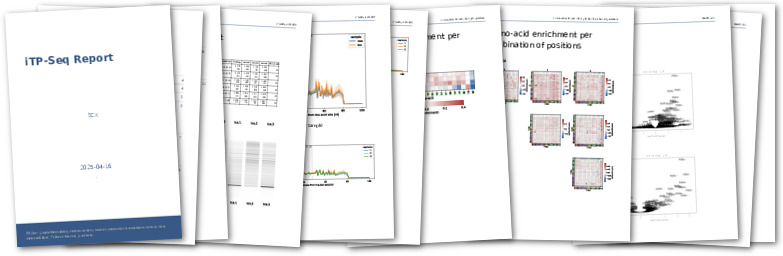
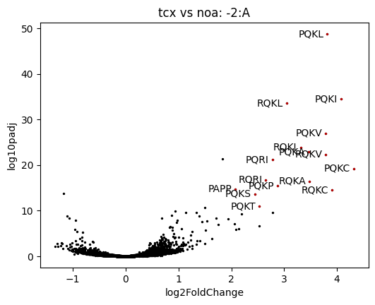
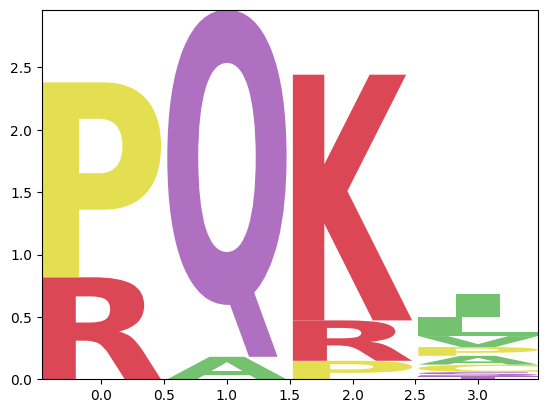
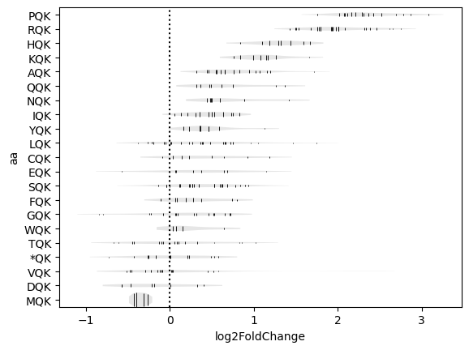

.. _tetracenomycin:

=========================================================================
Tetracenomycin X sequesters peptidyl-tRNA during translation of QK motifs
=========================================================================

:Authors: Elodie C Leroy, Thomas N Perry, Thibaud T Renault, C Axel Innis
:Published: Nat Chem Biol 2023 Sep;19(9):1091-1096
:DOI: `10.1038/s41589-023-01343-0 <https://doi.org/10.1038/s41589-023-01343-0>`_

This case study demonstrates the application of the ``itpseq`` library to analyze inverse toeprinting sequencing data from *E. coli* ribosomes treated with tetracenomycin X (TcmX).
Starting with raw sequencing data processing, we showcase a workflow for identifying translation-inhibiting sequence motifs.
Our analysis revealed that TcmX specifically targets ribosomes translating QK motifs (with K in the P-site), with particularly strong effects on PQKC sequences.

.. The study illustrates how itpseq's statistical approaches and visualization tools can effectively identify sequence-dependent antibiotic mechanisms, providing insights that connect molecular structure to biological function in translation inhibition.

Data downloading and preprocessing
----------------------------------

In this section, we describe how to download the necessary data from the NCBI database for reproducing the analysis in our paper [1]_.
We assume that a UNIX-like system will be used and that `sra-tools <https://github.com/ncbi/sra-tools>`_ and `PEAR <https://cme.h-its.org/exelixis/web/software/pear/>`_ are installed.
Other tools can be used for this step if desired.

Download the datasets from the NCBI (`PRJNA854319 <https://www.ncbi.nlm.nih.gov/bioproject/?term=PRJNA854319>`_) in a new directory (``tetracenomycin``),
splitting the forward/reverse reads into two files:

.. code-block:: bash

    fastq-dump -O tetracenomycin --split-3 SRR19905808 SRR19905809 SRR19905810 SRR19905811 SRR19905812 SRR19905813

Move to the new directory:

.. code-block:: bash

    cd tetracenomycin

Combine the paired-end reads into single reads with ``pear``.
The ``-u0`` option sets the maximal proportion of uncalled bases in a read to 0 and ``-c126`` the upper bound for the quality score to 126.

.. code-block:: bash

    pear -u0 -c126 -f SRR19905813_1.fastq -r SRR19905813_2.fastq -o nnn15_noa1 >nnn15_noa1.log
    pear -u0 -c126 -f SRR19905812_1.fastq -r SRR19905812_2.fastq -o nnn15_noa2 >nnn15_noa2.log
    pear -u0 -c126 -f SRR19905811_1.fastq -r SRR19905811_2.fastq -o nnn15_noa3 >nnn15_noa3.log
    pear -u0 -c126 -f SRR19905810_1.fastq -r SRR19905810_2.fastq -o nnn15_tcx1 >nnn15_tcx1.log
    pear -u0 -c126 -f SRR19905809_1.fastq -r SRR19905809_2.fastq -o nnn15_tcx2 >nnn15_tcx2.log
    pear -u0 -c126 -f SRR19905808_1.fastq -r SRR19905808_2.fastq -o nnn15_tcx3 >nnn15_tcx3.log

This should result in 6 new fastq files (with a ``.assembled.fastq`` suffix) being created in the current directory:

.. code-block::

    nnn15_noa1.assembled.fastq  nnn15_noa2.assembled.fastq  nnn15_noa3.assembled.fastq
    nnn15_tcx1.assembled.fastq  nnn15_tcx2.assembled.fastq  nnn15_tcx3.assembled.fastq

Extracting inverse-toeprints and default analysis
-------------------------------------------------

This section describes how to use ``itpseq`` to extract the inverse-toeprints from the sequencing files and generate a report.
We assume that ``python`` (≥3.9) and ``pip`` are installed.

First install/update the ``itpseq`` tool.
This step is only required the first time or when updating the library to the latest version.

.. code-block:: bash

    pip install -U itpseq

The next step is to extract the inverse toeprint sequences from the input fastq files with ``itpseq parse``.
We use ``*.assembled.fastq`` as a pattern to only select the fastq files that were generated by PEAR.
In this step, the reads will be filtered to find the sequences between the left (``a1``) and right (``a2``) adaptors (``GTATAAGGAGGAAAAAAT``/``GGTATCTCGGTGTGACTG`` by default).
Options can be used to further filter the reads by peptide size (``--peptide-size``) or read quality (``--quality``).
Here we are using the default parameters (``--peptide-size 1-10 --quality 30``).

.. code-block:: bash

    itpseq parse *.assembled.fastq

This step should create 4 files per input fastq file.
Files ending in ``.nuc.itp.txt``/``.aa.itp.txt`` contain the nucleotide/amino-acid sequences of the inverse-toeprints,
files ending in ``.itp.log``/``.itp.json`` contain statistics and information on the parsed reads.
These files will be used later for the analysis.

``itpseq format`` can then be used to nicely format the inverse-toeprints:

.. code-block:: bash

    itpseq format --codons --aa nnn15_tcx1.nuc.itp.txt --limit 10

    #                           [E] [P] [A]
                                    ATG TCA cgtcaaacccaagt
                                     M   S  2
        ATG TTT ATC GTG AGA GGA TGG CAA GTA ccaaaatatatcta
         M   F   I   V   R   G   W   Q   V  9
                                        ATG ccgcgaacactgat
                                         M  1
                                ATG TGG CAG cgtaaccgtacat
                                 M   W   Q  3
                                ATG TAA ACA ccaagcttatac
                                 M   *   T  3
    ATG GAA GTG CAC GCG ACA ACT AGC GGA CAA gctcccaggtact
     M   E   V   H   A   T   T   S   G   Q  10
    ATG CAC CCC AAT TAC ACA AGC TAG CCA GTC aggctatgcggcg
     M   H   P   N   Y   T   S   *   P   V  10
            ATG CCG ATC TCA GCG CGG ATG ATA ccaggacaatgg
             M   P   I   S   A   R   M   I  8
                                    ATG CCA ccttccaaattgct
                                     M   P  2
                    ATG TCG AGT GAG ACT TGA cacgccacccgaaa
                     M   S   S   E   T   *  6

In this example, an inverse-toeprint with a stop codon can be observed (``MHPNYTS*PV``), which can be caused by a frameshift or read-through during translation.
The subsequent analysis discards by default reads in which a stop is present in any position before the A-site.

A PDF report featuring a set of default analyses can further be generated  with ``itpseq report``
(read statistics,
virtual inverse-toeprint gel and read length distribution,
amino-acid enrichment per position,
amino-acid enrichment per combinations of positions,
volcano plots for motifs of amino-acids in the -2/E/P/A, E/P/A, and E/P sites).

``itpseq`` infers the sample groups from the file names.
By default a ``<lib_type>_<sample><X>`` format is recognized and samples are grouped by ``lib_type`` and ``sample``.
If a sample is named ``noa``, it is used as a reference (see. :ref:`naming`).
Here we only keep the ``sample`` identifier (``-k sample`` option) as all libraries are ``nnn15``.

.. code-block:: bash

    itpseq report -k sample .

This should create an :download:`itpseq_report.pdf <../_static/itpseq_report.pdf>` file in the current directory.

Advanced motif analysis
-----------------------

Additional analyses and data visualization can be produced using the :ref:`Python API <api>`.

The dataset is :ref:`loaded <loading_data>` in Python using:

.. code-block:: python

    >>> from itpseq import DataSet
    >>> data = DataSet('.', keys=['sample'])
    >>> data
    DataSet(data_path='.',
        file_pattern='(?P<lib_type>[^_]+)_(?P<sample>[^_\\d]+)(?P<replicate>\\d+)',
        samples=[Sample(noa:[1, 2, 3]),
                 Sample(tcx:[1, 2, 3], ref: noa)],
        )

This dataset is comprised of two samples with 3 replicates each,
the tetracenomycin X treated condition (``tcx``) and the untreated reference (``noa``).
By default, ``noa`` is automatically assigned as reference to the treated condition(s).

.. code-block:: python

    >>> data.samples
    {'noa': Sample(noa:[1, 2, 3]), 'tcx': Sample(tcx:[1, 2, 3], ref: noa)}

The enrichment statistics for motifs of 4 amino-acids in the -2 to A sites (-2/E/P/A) can be computed with the :meth:`~itpseq.Sample.DE` method:

.. code-block:: python

    >>> data['tcx'].DE('-2:A')
           baseMean  log2FoldChange     lfcSE      stat        pvalue          padj  log10pvalue  log10padj
    PCKC  13.653312        5.413686  1.117368  4.845036  1.265887e-06           NaN     5.897605        NaN
    HCKC   4.525252        4.683871  1.601314  2.925016  3.444381e-03           NaN     2.462889        NaN
    PQKM  11.285565        4.532762  0.980396  4.623399  3.775020e-06           NaN     5.423081        NaN
    HQKC  17.090112        4.378092  0.756084  5.790484  7.018383e-09           NaN     8.153763        NaN
    PQKC  52.587604        4.315985  0.437815  9.858015  6.328800e-23  5.327583e-20    22.198679   19.27347
    ...         ...             ...       ...       ...           ...           ...          ...        ...
    YEQV   2.434938       -4.737425  2.239550 -2.115347  3.440036e-02           NaN     1.463437        NaN
    GIWL   2.578562       -4.803273  2.212529 -2.170943  2.993551e-02           NaN     1.523813        NaN
    LMCS   3.011165       -5.031829  2.160030 -2.329519  1.983161e-02           NaN     1.702642        NaN
    HIEY   3.088421       -5.061198  2.174427 -2.327600  1.993334e-02           NaN     1.700420        NaN
    FKQT   3.545624       -5.276249  2.130716 -2.476280  1.327593e-02           NaN     1.876935        NaN

    [168355 rows x 8 columns]

The table can be saved as a CSV file for further analysis:

.. code-block:: python

    >>> data['tcx'].DE('-2:A').to_csv('tcx_DE_table.csv')

Custom graphs can be computed using the ``DataSet`` or ``Sample`` methods (see :ref:`api`).

For example a :meth:`~itpseq.Sample.volcano` plot for the -2/E/P/A sites, highlighting the points with a ``log2FoldChange > 2`` and ``log10padj > 10``:

.. code-block:: python

    >>> ax = data['tcx'].volcano('-2:A', y='log10padj',
    ...                          query='(log2FoldChange > 2) & (log10padj > 10)')
    >>> ax.figure.savefig('volcano_plot.png', dpi=300)

A :meth:`~itpseq.Sample.subset_logo` of the enriched points can show the amino-acids favorable for stalling in the presence of TcmX.
In this example, the logo is computed from the red points of the previous plot:

.. code-block:: python

    >>> data['tcx'].subset_logo('-2:A', query='(log2FoldChange > 2) & (log10padj > 10)')

The enrichment for the various combinations of codons for a given motif can be shown with a :meth:`~itpseq.Sample.codon_violin` plot.
In this example, we analyzed motifs in the -2/E/P sites and fixed the residues in the E/P sites to QK to appreciate the role of the -2 site (``.``   denotes any residue).

.. code-block:: python

    >>> data['tcx'].codon_violin(pos='-2:P', motif='.QK')

Using the ``itpseq`` library to perform these types of analyses, we could reveal the sequence-dependent mechanism by which tetracenomycin X (TcmX) inhibits bacterial translation.
The most significant finding was the identification of the QK motif as a critical determinant for ribosome stalling in the presence of TcmX.
This specific amino acid combination in the E/P sites of the ribosome would not have been directly apparent through traditional sequence logo analysis of the total sequence data, demonstrating the value of our library's ability to identify and characterize context dependent ribosome stalling.

The ``itpseq`` library allowed us to analyze the stalling landscape of TcmX-bound ribosomes and isolate the sequence motifs most relevant to its inhibitory mechanism.
By integrating these results with structural data from cryo-EM studies, we were able to further elucidate how TcmX specifically interacts with nascent peptides containing the PQKC motif.
This combined approach revealed the unusual mechanism through which TcmX induces sequestration of the 3' adenosine of peptidyl-tRNA\ :sup:`Lys` in the drug-occupied nascent polypeptide exit tunnel of the ribosome.

References
----------

.. [1] Leroy EC, Perry TN, Renault TT, Innis CA. Tetracenomycin X sequesters peptidyl-tRNA during translation of QK motifs. Nat Chem Biol. 2023 Sep;19(9):1091-1096. doi: 10.1038/s41589-023-01343-0.

